# Relatório Técnico — AP2: Algoritmos e Estruturas de Dados

## 4.1 Identificação

**Alunos:** Gustavo da Silveira Roldão, Otavio Caporal, Eduardo Lopes Esfolha

---

## 4.2 Introdução

A implementação manual de estruturas de dados é fundamental para compreender como a memória é alocada e gerenciada em nível de ponteiros. Ao contrário das coleções prontas oferecidas por bibliotecas padrão, construir uma fila, pilha ou lista encadeada do zero exige que o desenvolvedor controle explicitamente cada referência entre nós, tratando casos como lista vazia, atualização de ponteiros de início e fim, e prevenção de ciclos indesejados. Esse processo desenvolve raciocínio preciso sobre o ciclo de vida dos objetos na heap, revela o custo real de operações como inserção e remoção, e prepara o programador para entender e depurar qualquer estrutura mais complexa que encontrar ao longo da carreira.

---

## 4.3 Implementação

### Atividade 1 — Fila de Pedidos Pendentes e Pilha de Pedidos Cancelados

**Estrutura do nó**

Ambas as estruturas compartilham a mesma classe `No`, que armazena um objeto `Pedido` (id + descrição) e uma referência `proximo` para o nó seguinte. O encadeamento é simples (unidirecional).

```java
Pedido pedido;
No proximo;
```

**FilaPendentes (FIFO)**

Mantém dois ponteiros: `inicio` (próximo a ser atendido) e `fim` (último inserido). Ao inserir (`enqueue`), o novo nó é ligado ao `fim` atual e `fim` passa a apontar para ele. Ao remover (`dequeue`), `inicio` avança para `inicio.proximo`.

**PilhaCancelados (LIFO)**

Mantém um único ponteiro `topo`. O push insere na frente da lista; o pop remove o `topo` e avança para `topo.proximo`.

**Casos críticos**

| Situação | Tratamento |
|---|---|
| Remoção em estrutura vazia | Verifica `inicio == null` / `topo == null` e exibe mensagem sem lançar exceção |
| Remoção do último elemento da fila | Após avançar `inicio`, verifica se `inicio == null` e nesse caso zera `fim` também, evitando referência solta |
| Push na pilha vazia | `novoNo.proximo = topo` (que é null) garante fim correto da cadeia |

---

### Atividade 2 — Playlist com Lista Duplamente Encadeada

**Estrutura do nó**

Cada nó armazena um objeto `Musica` (título, artista, álbum, duração) e **dois** ponteiros: `proximo` e `anterior`, permitindo navegação bidirecional.

```java
Musica musica;
No proximo;
No anterior;
```

A classe `Playlist` mantém três ponteiros: `inicio`, `fim` e `atual` (música em reprodução), além de `tamanho` para evitar percursos completos em verificações de posição.

**Casos críticos**

| Situação | Tratamento |
|---|---|
| Remoção da única música | `inicio`, `fim` e `atual` recebem `null` |
| Remoção do início | `inicio` avança; `inicio.anterior` é zerado; se era a música atual, `atual` avança também |
| Remoção do fim | `fim` recua; `fim.proximo` é zerado com a mesma lógica para `atual` |
| Remoção do meio | `musicas.anterior.proximo = musicas.proximo` e `musicas.proximo.anterior = musicas.anterior` desconectam o nó sem quebrar a cadeia |
| Navegação circular | `proximaMusica()` e `musicaAnterior()` retornam ao extremo oposto quando atingem `null`, simulando loop sem criar ciclo real na estrutura |
| Ordenação com música em reprodução | Após trocar apenas os dados (`Musica`) dos nós, percorre a lista para reencontrar o objeto `musicaAtual` por referência e atualiza `atual` |

---

### Atividade 3 — Carrossel de Anúncios com Lista Circular

**Estrutura do nó**

`Anuncio` armazena id, empresa, descrição e um ponteiro `proximo`. A classe `CarrosselCircular` mantém **apenas um ponteiro** `anuncioAtual`; o último nó aponta de volta para o primeiro, formando o ciclo.

```java
Anuncio proximo; // sempre aponta para o próximo; no último nó, aponta para o primeiro
```

**Casos críticos**

| Situação | Tratamento |
|---|---|
| Inserção no carrossel vazio | `novoAnuncio.proximo = novoAnuncio` — o nó aponta para si mesmo, formando ciclo de tamanho 1 sem nulls |
| Inserção com elementos existentes | Novo nó é inserido após `anuncioAtual`: `novoAnuncio.proximo = anuncioAtual.proximo` e `anuncioAtual.proximo = novoAnuncio` |
| Remoção do único elemento | Verifica `anuncioAtual.proximo == anuncioAtual` antes de qualquer percurso e zera `anuncioAtual` |
| Remoção do `anuncioAtual` | Antes de desligar o nó, avança `anuncioAtual` para o próximo, garantindo que o ponteiro principal nunca aponte para um nó removido |
| Prevenção de loop infinito em `listarCicloCompleto` | Usa `do-while` com condição `atual != inicio`, iterando exatamente um ciclo completo |
| Prevenção de loop infinito em `removerAnuncio` | Loop `do-while` termina quando `anterior` volta a ser `anuncioAtual`, evitando percurso infinito quando o id não existe |

---

## 4.4 Evidências de Execução

### Atividade 1 — Fila de Pedidos + Pilha de Cancelados

**Adicionando novo pedido**

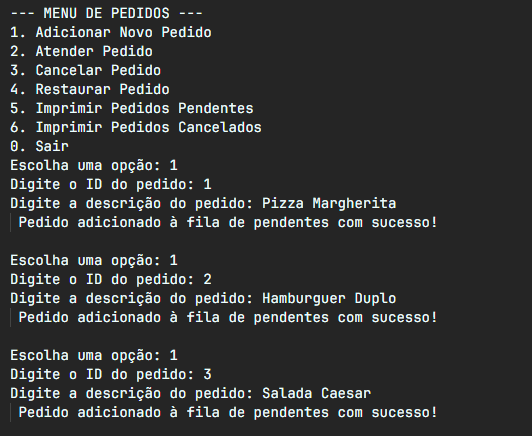

**Imprimindo fila de pendentes**

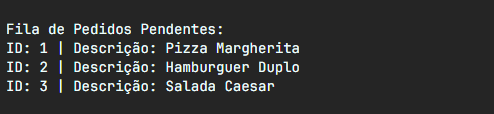

**Cancelando pedido**

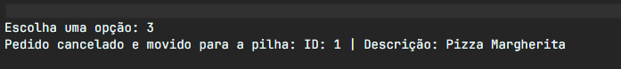

**Imprimindo pedidos cancelados**

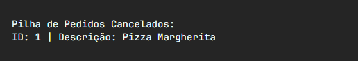

**Restaurando pedido**

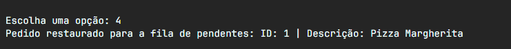

**Fila atualizada após restauração**

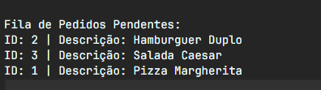

**Atendendo pedido e saindo**

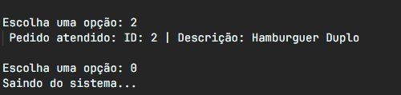

---

### Atividade 2 — Playlist

**Adicionando músicas à playlist**

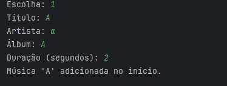

**Tocando música atual**

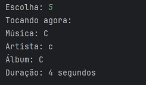

**Removendo por título**

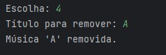

**Ordenando por artista**

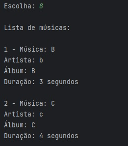

---

### Atividade 3 — Carrossel Circular de Anúncios

**Adicionando anúncios**

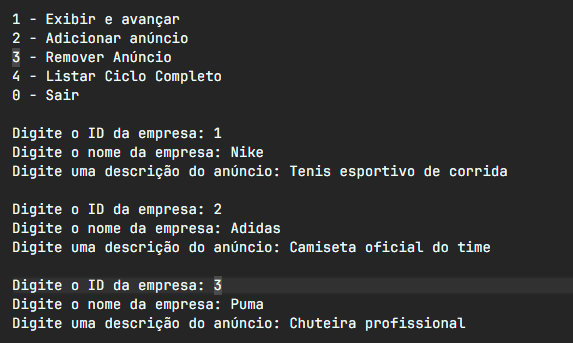

**Listando ciclo completo**

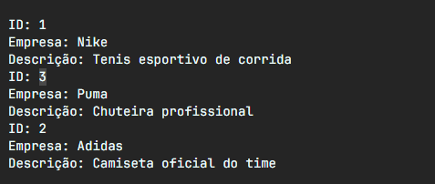

**Exibindo e avançando**

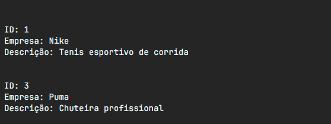

**Removendo anúncio**

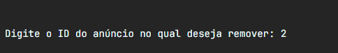

**Lista após remoção**

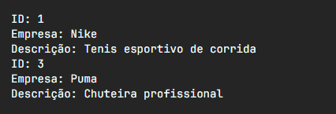

---

## 5. Conclusão

**Principais dificuldades e como foram resolvidas**

A maior dificuldade na Atividade 1 foi garantir que `fim` fosse zerado ao remover o último elemento da fila — um bug silencioso que só aparece ao tentar inserir após esvaziar a lista. A solução foi adicionar a verificação `if (inicio == null) fim = null` imediatamente após o avanço do ponteiro no `dequeue`.

Na Atividade 2, o desafio foi a remoção de nós em uma lista duplamente encadeada: qualquer ordem incorreta na atualização de `proximo` e `anterior` corromperia a estrutura sem erro imediato. A abordagem foi tratar separadamente os quatro casos (único elemento, início, fim, meio) para que cada ponteiro fosse ajustado na sequência exata.

Na Atividade 3, o maior cuidado foi evitar loop infinito tanto no `listarCicloCompleto` quanto no `removerAnuncio`. Ambos usam `do-while` com referência ao nó de partida para garantir exatamente um ciclo completo.

**Aprendizado**

As três atividades reforçaram que estruturas de dados manuais exigem atenção ao estado do sistema antes e depois de cada operação com ponteiros. Pequenos descuidos — um ponteiro `fim` não zerado, uma referência `anterior` não atualizada, um `do-while` sem condição de parada correta — produzem bugs difíceis de rastrear. Implementar essas estruturas do zero tornou claro por que as coleções da biblioteca padrão são confiáveis: elas encapsulam exatamente esse conjunto de casos críticos.
